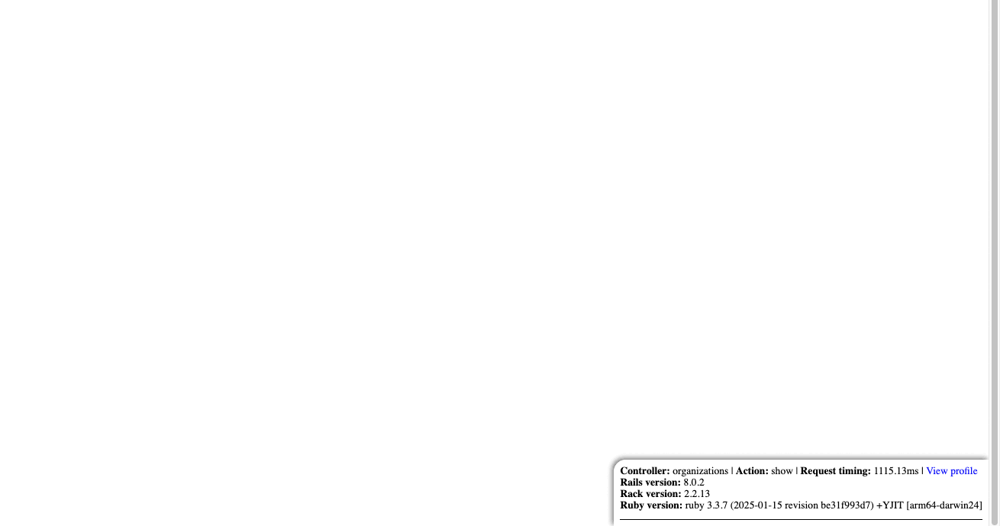

# Dial


A modern profiler for your Rails application.

Utilizes [vernier](https://github.com/jhawthorn/vernier) for profiling and
[prosopite](https://github.com/charkost/prosopite) for N+1 query detection.

> [!NOTE]
> Check out the resources in the vernier project for more information on how to
> interpret the viewer, as well as comparisons with other profilers, including `stackprof`.



## Installation

1. Add the gem to your Rails application's Gemfile:

```ruby
group :development do
  gem "dial"
end
```

2. Install the gem:

```bash
bundle install
```

3. Mount the engine in your `config/routes.rb` file:

```ruby
# this will mount the engine at /dial
mount Dial::Engine, at: "/" if Rails.env.development?
```

4. (Optional) Configure the gem in an initializer:

```ruby
# config/initializers/dial.rb

Dial.configure do |config|
  config.vernier_interval = 100
  config.vernier_allocation_interval = 10_000
  config.prosopite_ignore_queries += [/pg_sleep/i]
end
```

## Options

Option | Description | Default
:- | :- | :-
`vernier_interval` | Sets the `interval` option for vernier. | `200`
`vernier_allocation_interval` | Sets the `allocation_interval` option for vernier. | `2_000`
`prosopite_ignore_queries` | Sets the `ignore_queries` option for prosopite. | `[/schema_migrations/i]`
`content_security_policy_nonce` | Sets the content security policy nonce to use when inserting Dial's script. Can be a string, or a Proc which receives `env` and response `headers` as arguments and returns the nonce string. | Rails generated nonce or `nil`

## Comparison with [rack-mini-profiler](https://github.com/MiniProfiler/rack-mini-profiler)

|                           | rack-mini-profiler                 | Dial                                                    |
| :------------------------ | :--------------------------------- | :------------------------------------------------------ |
| Compatibility             | Any Rack application               | Only Rails applications                                 |
| Database Profiling        | Yes                                | Yes (via vernier hook - marker table, chart)            |
| N+1 Query Detection       | Yes (*needs to be inferred)        | Yes (via prosopite)                                     |
| Ruby Profiling            | Yes (with stackprof - flame graph) | Yes (via vernier - flame graph, stack chart, call tree) |
| Ruby Allocation Profiling | Yes (with stackprof - flame graph) | Yes (via vernier - flame graph, stack chart, call tree) |
| Memory Profiling          | Yes (with memory_profiler)         | Yes (*overall usage only) (via vernier hook - graph)    |
| View Profiling            | Yes                                | Yes (via vernier hook - marker table, chart)            |
| Snapshot Sampling         | Yes                                | No                                                      |
| Production Support        | Yes                                | No (WIP)                                                |

> [!NOTE]
> SQL queries displayed in the profile are not annotated with the caller location by default. If you're not using the
> [marginalia](https://github.com/basecamp/marginalia) gem to annotate your queries, you will need to extend your
> application's [ActiveRecord QueryLogs](https://edgeapi.rubyonrails.org/classes/ActiveRecord/QueryLogs.html) yourself.

## Development

After checking out the repo, run `bin/setup` to install dependencies. Then, run `bundle exec rake test` to run the
tests. You can also run `bin/console` for an interactive prompt that will allow you to experiment.

## Contributing

Bug reports and pull requests are welcome on GitHub at https://github.com/joshuay03/dial.

## License

The gem is available as open source under the terms of the [MIT License](https://opensource.org/licenses/MIT).

## Code of Conduct

Everyone interacting in the Dial project's codebase and issue tracker is expected to follow the
[code of conduct](https://github.com/joshuay03/dial/blob/main/CODE_OF_CONDUCT.md).
